# 异常,中断

# 中断硬件原理

如果没有使用 `medeleg / medeleg` 对中断委托的话，触发中断，会陷入到 `m-mode` 处理；如果配置了，就在 `s-mode` 处理；

## 中断类型

在不同模式下，触发相同的中断，中断编号不一样，如：

在 `m-mode` 模式中执行 `ecall`，会触发 `Environment cal from M-mode` ;

在 `s-mode` 模式中执行 `ecall`，就触发 `Environment cal from S-mode` ;

在 `u-mode` 模式中执行 `ecall`，就触发 `Environment cal from U-mode` ，`syscall` 就是基于这个；

- m-mode
    
    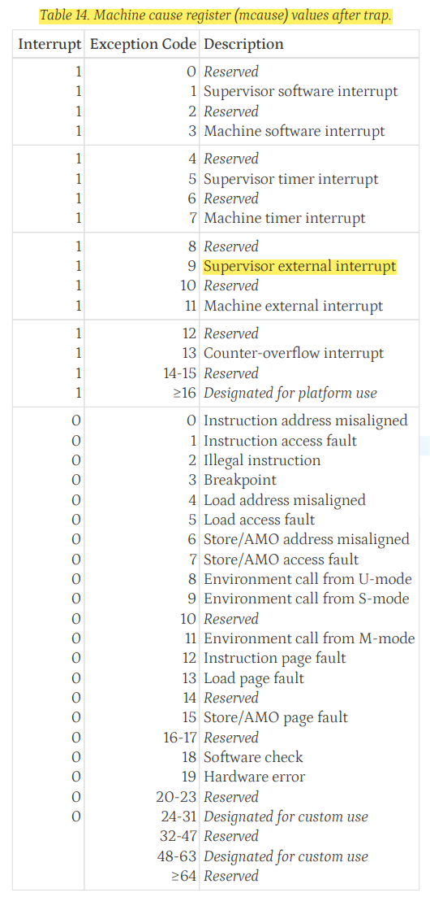
    

- s-mode 只包含 s，u 的中断
    
    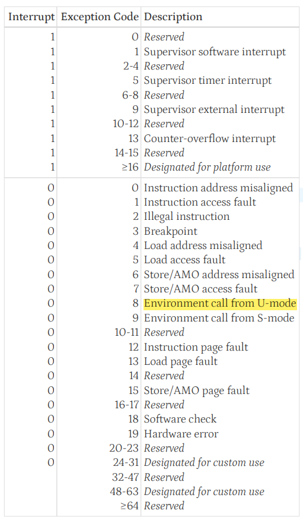
    

## 异常的优先级

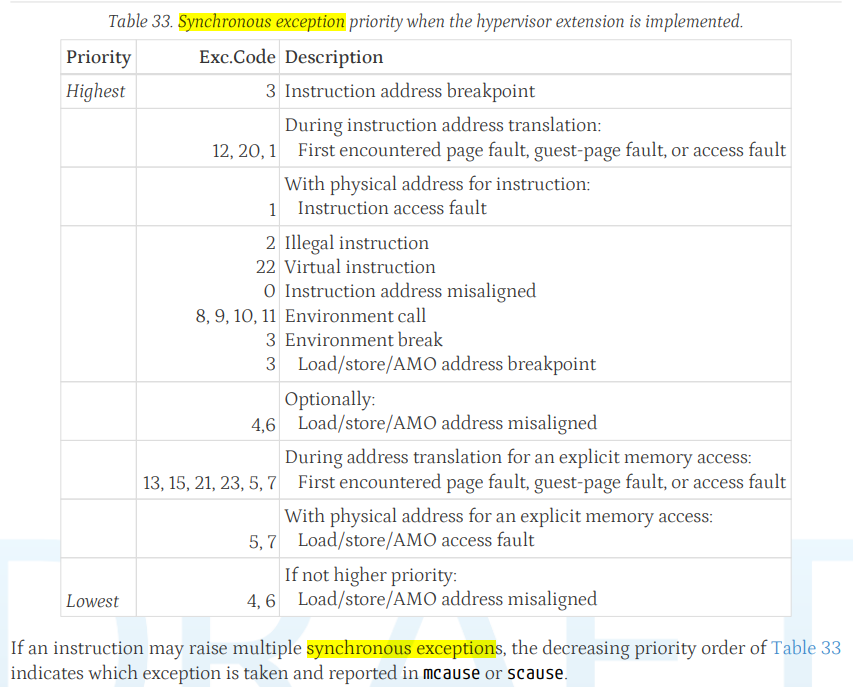

## 中断模式

riscv 有两种中断模式，通过 `MODE` 配置，不同的中断模式，中断向量不一样，如下：

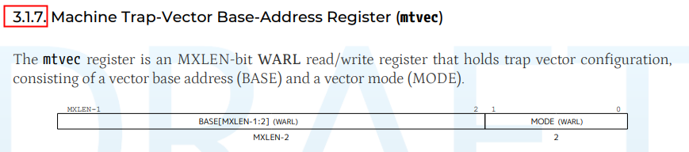

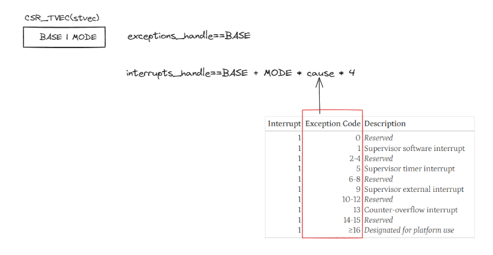

## 软件触发中断

### ecall (`syscall` 基于这个)

在 `m-mode` 模式中执行 `ecall`，会触发 `Environment cal from M-mode` ;

在 `s-mode` 模式中执行 `ecall`，就触发 `Environment cal from S-mode` ;

在 `u-mode` 模式中执行 `ecall`，就触发 `Environment cal from U-mode` ，`syscall` 就是基于这个；

`sepc` 被配置为指令执行的地址，中断返回前，`sepc` 要加 `sizeof(ecall)`

```c
// syscall 的流程
void do_trap_ecall_u(struct pt_regs *regs)
{
	if (user_mode(regs)) {
		long syscall = regs->a7; // a7 作为系统调用号

		regs->epc += 4; // sepc + 4 
	...
}
```

### ebreak (调试器用的，被用作 `software breakpoint`)

当 `hw_breakpoint(指令断点，数据断点)` 不够的时候，调试器会使用 `sw_breakpoint` 作为 `breakpoint`；

`sw_breakpoint` 原理，就是调试器在要打断点的位置，把原来的指令替换为 `ebreak`，当执行到这里的时候，就触发异常了；

ebreak，断点触发可能有以下情况：

- 被配置为 ebreak 触发，进入 debug mode（`dcsr.ebreakx == 1`，详细 [Debug Mode](https://www.notion.so/Debug-Mode-e2591d4ada4345deacc220eab14bf70b?pvs=21) ）：
    
    触发断点时，cpu 会停止运行，进入 `debug mode` 由调试器控制；
    
    调试器将 cpu 重新运行的时候，会将打断点的位置，恢复回原来的指令，然后返回继续运行；
    
- 被配置为 ebreak 触发，不进入 debug mode：
    
    触发断点时，系统会触发 `breakpoint 异常`（hw_breakpoint，step，ebreak 都会触发）
    
    ```c
    do_trap_break
    |- handle_break(regs);
    	 |- if (probe_single_step_handler(regs)) return; // 单步中断
    	 |- if (probe_breakpoint_handler(regs)) return; // hw_breakpoint, ebreak
    ```
    

## 中断返回

中断返回使用 `xret(x= m, s)`，执行 `xret` 时，会配置 `pc = xepc(x = m, s);`

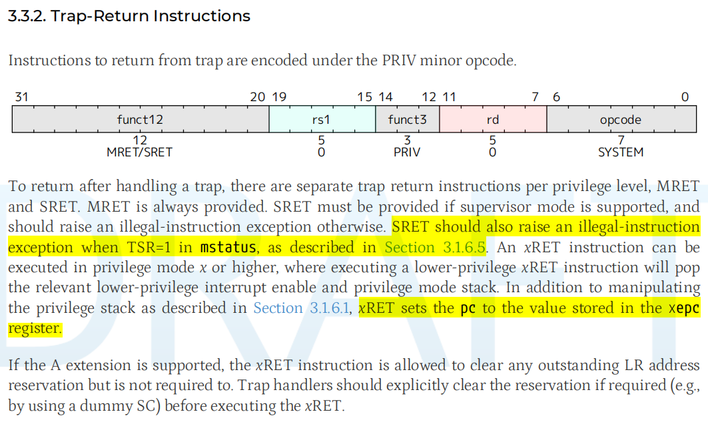

# 中断处理流程

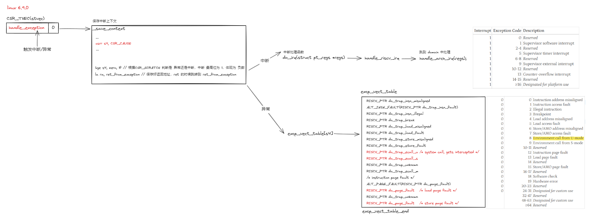

```c
handle_exception
|- .Lsave_context // 将数据压入内核栈
	 |- move a0, sp /* pt_regs */
	 |- la ra, ret_from_exception // 保存好返回地址，ret 的时候跳转到 ret_from_exception, ret_from_exception 会调用 sret 返回到出现异常的位置
	 |- bge s4, zero, 1f // 根据 CSR_CAUSE 判断是 异常还是中断，中断 最高位为 1，体现为 负数
	 |- tail do_irq // do_irq 中断处理函数，跳到 domain 中处理
		  |- call_on_irq_stack(regs, handle_riscv_irq); // 切换中断使用的栈为 irq_stack_ptr ，防止内核栈溢出
			   |- riscv_intc_aia_irq
					  |- generic_handle_domain_irq(intc_domain, topi >> TOPI_IID_SHIFT); // aia 的 hw irq 从 **CSR_TOPI** 获取
							 ...
							 |- riscv_timer_interrupt // RV_IRQ_TIMER
							 |- imsic_handle_irq // RV_IRQ_EXT
								  |- ipi_mux_process(); // ipi 
								  |- generic_handle_domain_irq(imsic->base_domain, vec->hwirq); // aplic 外设中断
	 |- jr t0 // t0 = excp_vect_table[csr_cause]
```

# AIA 硬件原理（riscv-interrupt）

## 寄存器

```c
domaincfg // 配置 aia 的模式（direct delivery mode / MSI delivery mode）
sourcecfg // 配置中断触发类型，上升沿之类的
target // 配置向 imsic 发生 msi 的地址（hart id，guest id），和信息
```

## APLIC

用于和外设相连，具有两种模式：1. 可以直接给 cpu 发电信号；2. 如果实现了 imsic ，可以直接给 imsic 发送 msi；

不同的特权等级有对应的 `interrup domain`，每个特权等级连接 cpu 各个特权等级的 `ee`，或者发送到 imsic 对应特权等级的 `interrup file`；

如果使用 msi 模式，`tartget[x]` 决定了硬件中断 x，往 imsic 发的 `msi msg`；通过 `xmsiaddrcfg，xmsiaddrcfgh` 决定发送到哪个 `interrup file`；

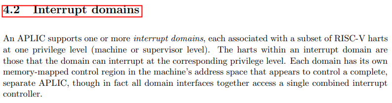

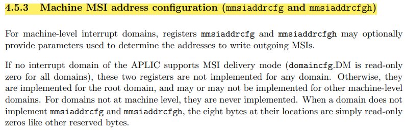

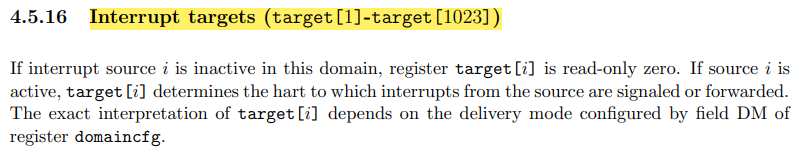

## IMSIC

### interrupt file 的地址映射

每个 hart 对应一组 `interrupt files`，其中包括 一个 m-file，一个 s-file，hsxlen 个 g-file；

所有的 interrupt files 都是映射到同块内存，每个 interupt file 占用 `4k`，各个 interupt file 连续排列，排完一个 hart 再排下一个 hart；

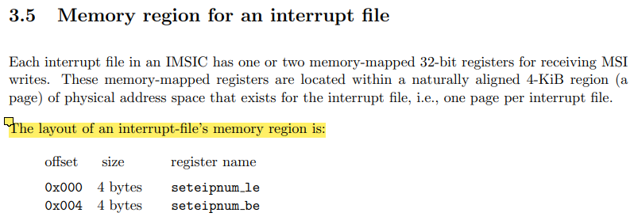

### *iselect 间接范围 interrupt file 寄存器

interrupt file 只有 `seteipnum_xx` 映射到内存，其他寄存器需要使用 `*iselect` 间接访问；

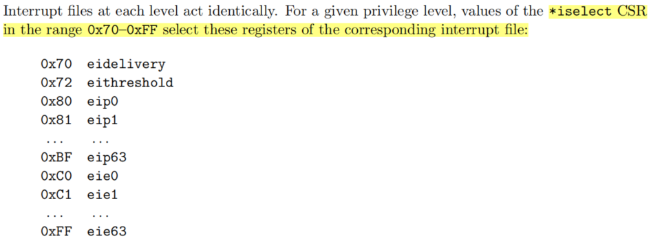

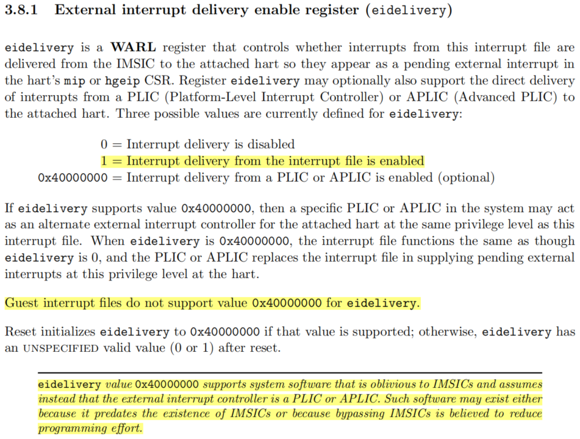

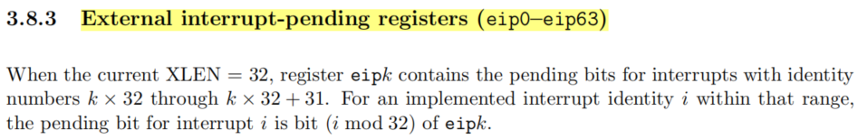

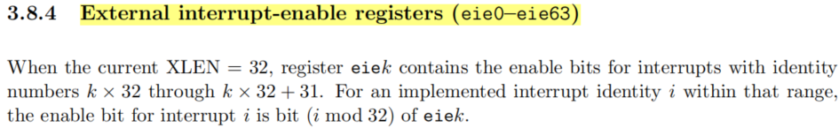

## AIA（IMSIC）中断配置框架

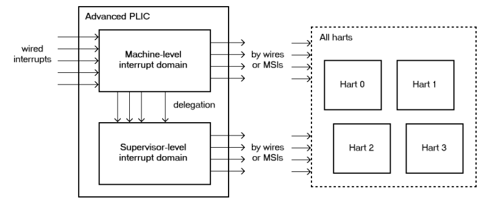

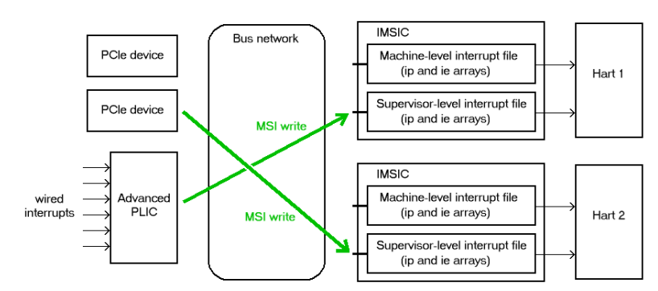

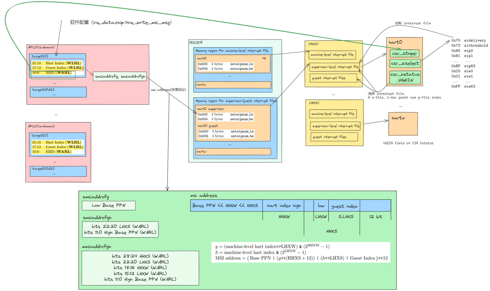

# linux domain 连接关系

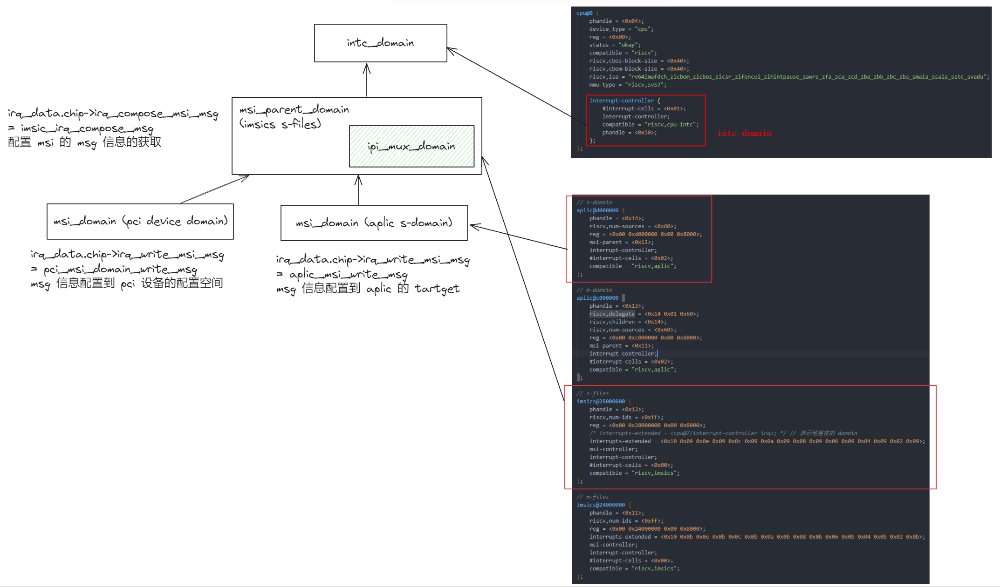

# linux irq 关系

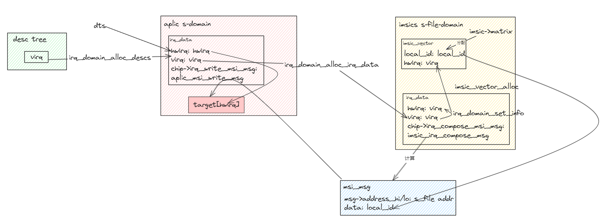

# 中断初始化代码流程

`Documentation/devicetree/bindings/interrupt-controller/riscv,aplic.yaml`

```c
init_IRQ
|- init_irq_stacks // 初始化 irq_stack_ptr 
|- irqchip_init(); // dts 中的 中断控制器匹配，IRQCHIP_DECLARE(xx, xx, xx) 注册的 domain
	 |- riscv_intc_init // 注册 **intc_domain** 
	 |  |- return riscv_intc_init_common(of_node_to_fwnode(node), chip); // chip == riscv_intc_chip
	 |	   |- intc_domain = irq_domain_create_tree(fn, &riscv_intc_domain_ops, chip);
	 |	   |- rc = set_handle_irq(&riscv_intc_aia_irq); // 配置 handle_arch_irq
	 |- imsic_early_dt_init // 注册 **ipi_mux_domain**  
		  |- rc = imsic_setup_state(fwnode)
			   |- rc = imsic_parse_fwnode(fwnode, global, &nr_parent_irqs, &nr_mmios); // 初始化 **imsic->global**
						|- rc = imsic_get_mmio_resource(fwnode, 0, &res); // 获取 s-file 的 memory 地址范围（即 msi addr 地址范围）
				 |- mmios_va[i] = ioremap(mmios[i].start, resource_size(&mmios[i])); // remap s-file memory, 以便后面发ipi 时使用
				 |- rc = imsic_local_init(); // 初始化 per_cpu_ptr(imsic->lpriv, cpu)，主要用来 记录 各个cpu imsic 各个中断（**lpriv->vectors[i]**）的状态
				 |- local->msi_pa = mmios[index].start + reloff; // 配置 各个 cpu s-file memory 的物理地址，后面会根据这个值，填写 **aplic_tartget[i]**
				 |- local->msi_va = mmios_va[index] + reloff; // 配置 各个 cpu s-file memory 的虚拟地址，可以用来**软件发送 msi**
				 |- rc = imsic_matrix_init(); // 初始化 imsic->matrix，用来申请 imsic 中断的
			|- rc = imsic_early_probe(fwnode); 
				 |- imsic_parent_irq = irq_create_mapping(domain, RV_IRQ_EXT); // 向 **intc_domain** 注册 RV_IRQ_EXT中断，imsic 通过 RV_IRQ_EXT 上来
				 |- rc = imsic_ipi_domain_init();
						|- virq = ipi_mux_create(IMSIC_NR_IPI, imsic_ipi_send);  // 注册 **ipi_mux_domain** 用于管理 ipi
						|- riscv_ipi_set_virq_range(virq, IMSIC_NR_IPI, true);
							 |- request_percpu_irq(ipi_virq_base + i, handle_IPI, "IPI", &ipi_dummy_dev); // 注册 ipi 中断请求，handle_IPI
				 |- irq_set_chained_handler(imsic_parent_irq, **imsic_handle_irq**); // 改变 desc-> handle, 使 **intc_domain** 中 RV_IRQ_EXT 中断，走 imsic 的中断处理
				 |- cpuhp_setup_state(CPUHP_AP_IRQ_RISCV_IMSIC_STARTING, "irqchip/riscv/imsic:starting", imsic_starting_cpu, imsic_dying_cpu); // 注册 start_cpu 的回调			 
|- sbi_ipi_init(); // 使用 sbi 发 ipi 的时候调用，aia 不用

// time 中断申请
time_init
|- timer_probe
	 |- ret = init_func_ret(np);
		  |- return riscv_timer_init_common();
				 |- riscv_clock_event_irq = irq_create_mapping(domain, RV_IRQ_TIMER); // 向 **intc_domain** 注册 RV_IRQ_TIMER 中断
				 |- error = request_percpu_irq(riscv_clock_event_irq, riscv_timer_interrupt, "riscv-timer", &riscv_clock_event); // 注册中断处理函数
				 
// 前面注册了 imsic 设备，所有调用到这里
imsic_platform_probe
|- return imsic_irqdomain_init();
	 |- imsic->base_domain = irq_domain_create_tree(imsic->fwnode, &imsic_base_domain_ops, imsic); // 注册 **imsic_domain**
	 |- imsic->base_domain->flags |= IRQ_DOMAIN_FLAG_MSI_PAREN 
	 |- imsic->base_domain->msi_parent_ops = &imsic_msi_parent_ops; 
	 | static const struct msi_parent_ops imsic_msi_parent_ops = {
	 |	.supported_flags	= MSI_GENERIC_FLAGS_MASK |
	 |				  MSI_FLAG_PCI_MSIX,
	 |	.required_flags		= MSI_FLAG_USE_DEF_DOM_OPS |
	 |				  MSI_FLAG_USE_DEF_CHIP_OPS,
	 |	.bus_select_token	= DOMAIN_BUS_NEXUS,
	 |	.bus_select_mask	= MATCH_PCI_MSI | MATCH_PLATFORM_MSI,
	 |	.init_dev_msi_info	= **imsic_init_dev_msi_info**,
	 |};

// 前面注册了 aplic 设备，所以调用到这里
aplic_probe
|- rc = aplic_msi_setup(dev, regs);
	 |- rc = aplic_setup_priv(priv, dev, regs); // 对 aplic 上的中断状态复位
	 |- mc->lhxs = imsic_global->guest_index_bits; // 配置 priv->msicfg 中的 **base_ppn lhxs，lhxw，hhxw，hhxs**，后面注册中断时，初始化 **aplic_tartget[i]** 会用到 
	 |- aplic_init_hw_global(priv, true); // 初始化 aplic_domaincfg, APLIC_xMSICFGADDRx
	 |- msi_create_device_irq_domain(dev, MSI_DEFAULT_DOMAIN, **&bundle->info**: &aplic_msi_template, priv->nr_irqs + 1, priv, priv); // **aplic_domain** 作为 msi_domain 注册, 注册后面申请中断的 chip.ops
	 | static const struct msi_domain_template **aplic_msi_template** = {
	 | 	.chip = {
	 | 		...
	 | 		.irq_write_msi_msg	= **aplic_msi_write_msg**, // 注册中断的时候会用到
	 | 		...
	 | }
		 |- pops->init_dev_msi_info(dev, parent, parent, &bundle->info); // **imsic_init_dev_msi_info**
			  |- info->chip->irq_set_affinity = imsic_irq_set_affinity;
			  |- info->flags |= MSI_FLAG_ALLOC_SIMPLE_MSI_DESCS | MSI_FLAG_FREE_MSI_DESCS;
		 |- domain = __msi_create_irq_domain(fwnode, &bundle->info, IRQ_DOMAIN_FLAG_MSI_DEVICE, parent); // 更新 info.chip 会作为 domain 的 irq 的 chip 
				|- domain = irq_domain_create_hierarchy(parent, flags | IRQ_DOMAIN_FLAG_MSI, 0, fwnode, &msi_domain_ops, **host_data: info**);
 
// aplic 外设中断注册，会获得 virq
platform_get_irq_optional
|- ret = of_irq_get(to_of_node(fwnode), num); // 返回 virq
...
|- virq = msi_device_domain_alloc_wired(domain, hwirq, type); // domain == **aplic_domain** 
...
|- virq = irq_domain_alloc_descs(irq_base, nr_irqs, 0, node, affinity); // 从系统获取 virq
|- irq_domain_alloc_irq_data(domain, virq, nr_irqs) // 构建 parent_domain 的 irq_data
	 ...
	 |- struct msi_domain_info *info = **domain->host_data**; // msi_domain_alloc
	 |- ret = irq_domain_alloc_irqs_parent(domain, virq, nr_irqs, arg);
		  |- return imsic_irq_domain_alloc(domain, irq_base, nr_irqs, arg); // **imsics_domain** 申请中断
			   |- vec = imsic_vector_alloc(hwirq: virq, cpu_online_mask); // 申请 imsic_vector，**lpriv->vectors[i]**
					  |- vec->hwirq = hwirq; // **imsic_handle_irq** 会用到
			|  // **imsic_irq_base_chip** 用来后面，外设注册中断处理函数时，调用 pos->chip->irq_compose_msi_msg 处理 msi msg
		  |- irq_domain_set_info(domain, virq, virq, &**imsic_irq_base_chip**, vec, handle_simple_irq, NULL, NULL); // 配置 desc[virq].irq_data.parent_data.hwirq = virq, 后面 **imsic_handle_irq** 处理中断的时候，
			|                                                                                                     // 就可以正确跳转到外设注册的 desc[virq].action (hwirq -> irq_data.virq -> desc[virq].action)
	 |- ret = ops->msi_init(domain, info, virq + i, hwirq + i, arg); // msi_domain_ops_init
	    |- irq_domain_set_hwirq_and_chip(domain, virq, hwirq, info->chip, info->chip_data); // 设置 **aplic_domain** irq_data 的 chip（**aplic_msi_template.chip**），申请中断的时候用
|- irq_domain_insert_irq(virq + i); // 对domain 以及 parent_domain 进行 hwirq -> irq_data 的映射(&domain->revmap_tree)
...

// 注册中断处理函数，向 virq 注册中断处理函数
request_threaded_irq
|- ret = irq_activate(desc);
	 |- return irq_domain_activate_irq(d, false);
		  |- ret = __irq_domain_activate_irq(irq_data, reserve);
			   |- ret = domain->ops->activate(domain, irqd, reserve); // msi_domain_activate (domain == **aplic_domain**)
				    |- BUG_ON(irq_chip_compose_msi_msg(irq_data, msg)); // 获取 msg 信息
					     |- pos->chip->irq_compose_msi_msg(pos, msg); // **imsic_irq_base_chip->irq_compose_msi_msg** (imsic_irq_compose_msg)
						      |- imsic_irq_compose_vector_msg(irq_data_get_irq_chip_data(d), msg);
				    |- data->chip->irq_write_msi_msg(data, msg); // aplic_msi_write_msg ,这里会更新 **aplic_target[i]**
```
