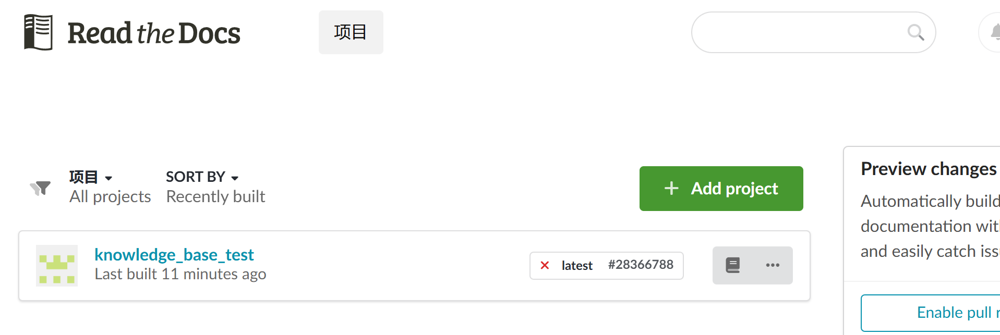
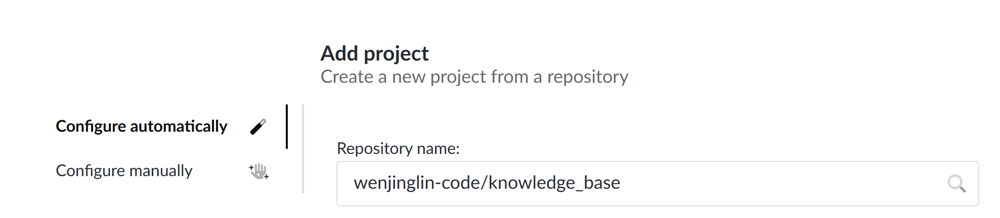
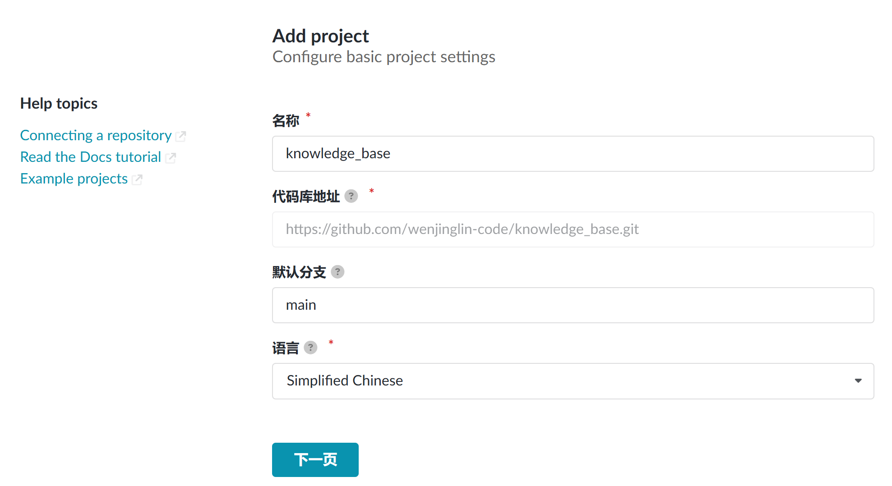
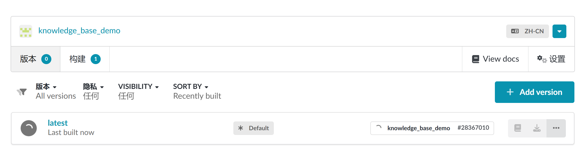

# 个人博客网站搭建

> **简单来说，就是先用 `Sphinx` 生成 html，然后用 GitHub 托管 html，再导入到 Read the Docs 生成在线文档。**
> 

# 1. 背景知识

---

## 1.1 Sphinx

Sphinx 是一个基于 Python 的文档生成项目。最早只是用来生成 Python 的项目文档，使用 reStructuredText 格式。但随着 Sphinx 项目的逐渐完善，目前已发展成为一个大众可用的框架，很多非 Python 的项目也采用 Sphinx 作为文档写作工具，甚至完全可以用 Sphinx 来写书。

Sphinx 网站：[http://sphinx-doc.org/](http://sphinx-doc.org/)
Sphinx 使用手册：[https://zh-sphinx-doc.readthedocs.io/en/latest/index.html](https://zh-sphinx-doc.readthedocs.io/en/latest/index.html)

## 1.2 Read the Docs

**`Read the Docs`** 是一个基于 Sphinx 的免费文档托管项目。可以基于 `GitHub` 的 `Sphix` 项目，生成在线文档；

Read the Docs 网站：[https://readthedocs.org/](https://readthedocs.org/)

# 2. 环境搭建

---

> 环境：ubuntu 24.04（wsl）
> 

## 2.1 安装必要的软件

```bash
# 1. 安装基础软件
sudo apt install git
sudo apt install make
sudo apt install python3
sudo apt install python3-pip 

# 2. Sphinx 及依赖
# pip3 可以正常使用的情况
pip3 install -U Sphinx        # sphix 框架
pip3 install sphinx-autobuild # sphix 项目，build 工具
pip3 install sphinx_rtd_theme # sphix 的 read to doc 主题
pip3 install recommonmark     # sphix 支持 markdown 源文件
pip3 install sphinx_markdown_tables # sphix 支持 markdown 表格

# pip3 有问题的情况，可以使用以下方式安装
sudo apt install python3-sphinx
sudo apt install python3-sphinx-autobuild
sudo apt install python3-sphinx-rtd-theme
sudo apt install python3-recommonmark
sudo apt install python3-sphinx-markdown-tables

# 3. 成功安装后，系统会存在 sphinx 的命令，如下：
sphinx-apidoc      sphinx-autobuild   sphinx-autogen     sphinx-build       sphinx-intl        sphinx-quickstar
```

## 2.2  初始化 sphinx 项目

```bash
# 1. 新建目录
mkdir knowledge_base
cd knowledge_base

# 2. 快速建立 sphinx 项目，按照如下操作建立
sphinx-quickstart
Welcome to the Sphinx 7.2.6 quickstart utility.

Please enter values for the following settings (just press Enter to
accept a default value, if one is given in brackets).

Selected root path: .

You have two options for placing the build directory for Sphinx output.
Either, you use a directory "_build" within the root path, or you separate
"source" and "build" directories within the root path.
> Separate source and build directories (y/n) [n]: y
# 独立的源文件和构建目录（y/n） 这里选择 y
# 选择 y，会创建 "source" 和 "build" 两个独立的目录，前者用于存放文档资源，后者用于保存构建生成的各种文件

The project name will occur in several places in the built documentation.
> Project name: knowledge_base # 项目的名称
> Author name(s): wenjinglin   # 作者的名字
> Project release []: v1       # 版本号
...
For a list of supported codes, see
https://www.sphinx-doc.org/en/master/usage/configuration.html#confval-language.
> Project language [en]: zh_CN # 选择语言
...
# 到这里就表示成功创建了
Finished: An initial directory structure has been created.

# 3. 创建后的目录结构
tree .
.
├── Makefile
├── build
├── make.bat
└── source
    ├── _static
    ├── _templates
    ├── conf.py
    └── index.rst

5 directories, 4 files

# 4. 构建并启用 http 服务，编译成功后就可以使用 http://127.0.0.1:8000/ 访问了
sphinx-autobuild source build/html
...
The HTML pages are in build/html.
[I 250602 12:42:05 server:335] Serving on http://127.0.0.1:8000
[I 250602 12:42:05 handlers:62] Start watching changes

```

## 2.3  配置 sphinx 项目

### sphinx 配置文件：`source/conf.py`

> 配置说明文档：https://sphinx-doc.cn/en/master/usage/configuration.html
> 

```bash
# 用于描述 Sphinx 文档的配置文件
#
# 配置的变量，可以查看下面的文档：
# https://sphinx-doc.cn/en/master/usage/configuration.html

# -- 项目信息 -----------------------------------------------------
# 具体格式，查看网页：
# https://sphinx-doc.cn/en/master/usage/configuration.html#project-information

project = 'wenjinglin\'s blog' # 网页的主题
copyright = '2025, wenjinglin'
author = 'wenjinglin' # 作者
release = 'v1' # 版本号

# -- 常规配置 ---------------------------------------------------
# 具体格式，查看网页：
# https://sphinx-doc.cn/en/master/usage/configuration.html#general-configuration

# 添加支持的扩展
extensions = [
    'recommonmark', # markdown文件支持
    'sphinx_markdown_tables', # markdown表格支持
]

# 整个文档书的根
master_doc = 'index' # index.md 作为根

# 源文件编码
source_encoding = 'utf-8'

# 源文件后缀
source_suffix = {
    '.md':'markdown',
}

templates_path = ['_templates']
exclude_patterns = []

language = 'zh_CN'

# -- HTML 输出选项 -------------------------------------------------
# 具体格式，查看网页：
# https://sphinx-doc.cn/en/master/usage/configuration.html#options-for-html-output

html_theme = 'sphinx_rtd_theme' # html 主题

# 主题对应的配置，sphinx_rtd_theme 可以配置：
# https://sphinx-rtd-theme.readthedocs.io/en/stable/configuring.html
# https://sphinx-locales.github.io/sphinx_rtd_theme/zh-CN/configuring.html
html_theme_options = {
    'collapse_navigation': False,           # 导航条目可以扩展 
    'navigation_depth': 5,                  # 目录树的最大深度（显示子标题层级）
    'sticky_navigation': True,              # 当你滚动页面时，导航与主页面内容一起滚动
    'includehidden': True,                  # 包含隐藏项
    'style_external_links': True,           # 为外部链接添加图标
    'prev_next_buttons_location': 'bottom', # 显示 Next 和 Previous 按钮的位置
    'style_external_links': True,           # 在外部链接旁边添加一个图标
    'logo_only': False,                     # 仅显示 Logo，隐藏项目名
    'display_version': True,                # 显示当前版本
}

# 自定义的 JS 文件
html_static_path = ['_static'] # 自定义的 JS 目录
html_js_files = [] # 自定义的 JS 文件名

# 设置网站 Logo
# html_logo = "path/to/logo.png"

# 设置网站图标（Favicon）
# html_favicon = "path/to/favicon.ico"
```

### read the docs 配置文件：`.readthedocs.yaml`

> Read the Docs 配置文件说明：https://docs.readthedocs.io/en/stable/config-file/v2.html
> 

```bash
# Read the Docs 配置文件
# Read the Docs configuration file
# See https://docs.readthedocs.io/en/stable/config-file/v2.html for details

# Required
version: 2

# Set the OS, Python version, and other tools you might need
build:
  os: ubuntu-24.04
  tools:
    python: "3.13"

# Build documentation in the "docs/" directory with Sphinx
# Sphinx 配置文件
sphinx:
   configuration: source/conf.py

# Optionally, but recommended,
# declare the Python requirements required to build your documentation
# Read the Docs 构建配置文件
# See https://docs.readthedocs.io/en/stable/guides/reproducible-builds.html
python:
   install:
   - requirements: pip.txt # 依赖的 pip 包
```

pip.txt

```bash
# pip.txt，安装编译依赖的 pip 包
sphinx-autobuild
sphinx_rtd_theme
recommonmark
sphinx-markdown-tables
```

### 添加忽略的 git 文件：`.gitignore`

```bash
build/
```

## 2.4  编写 sphinx 文档

> 内容可自行修改
> 
- 首页文档：**`source/index.md`**
    
    ```bash
    ## 中断异常
    [中断异常](markdown_file/interrupt.md)
    ```
    
- 其他文档：**`source/markdown_file/interrupt.md`**
    
    ```bash
    # 异常,中断
    ```
    
- 文档用到的图像：**`source/markdown_file/img/*`**

# 3. github 托管

```bash
# github 新建远程仓库（public）

# 本地仓库初始化，main 分支推不了，可以建立个新分支
cd knowledge_base
git init
git add .
git commit -m "first commit"
git branch -M main
git remote add origin git@github.com:wenjinglin-code/knowledge_base.git
git push -u origin main
```

# 4. read the docs 网页托管

> 在 Read the Docs 网站 [https://readthedocs.org/](https://readthedocs.org/) 注册，并绑定 GitHub 账户。点击 `Add project` 导入项目，输入项目名称和仓库地址即可。
> 
1. 点击 `Read the Docs Community`
    
    
    
2. 点击 `Add project`
    
    
    
3. 选择刚刚建立的仓库
    
    
    
4. 编辑一下项目的信息，点击 `下一页`
    
    
    
5. 等待构建完成，可以点击 `latest` 查看编译详情，编译完成后，点击 `View docs` 查看[网页](https://knowledge-base-demo.readthedocs.io/zh-cn/latest/)
    
    